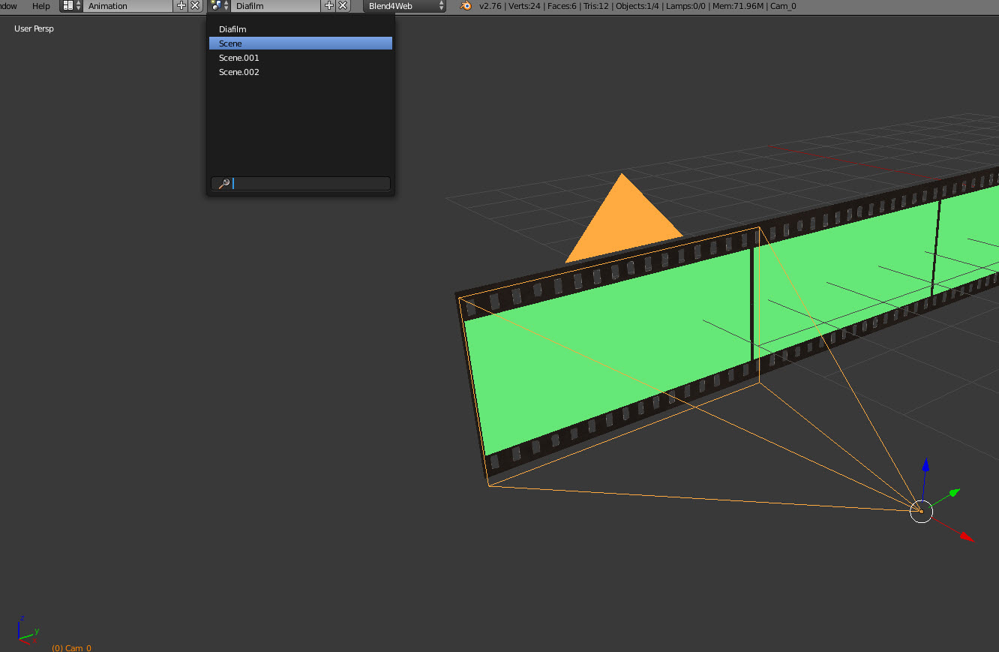
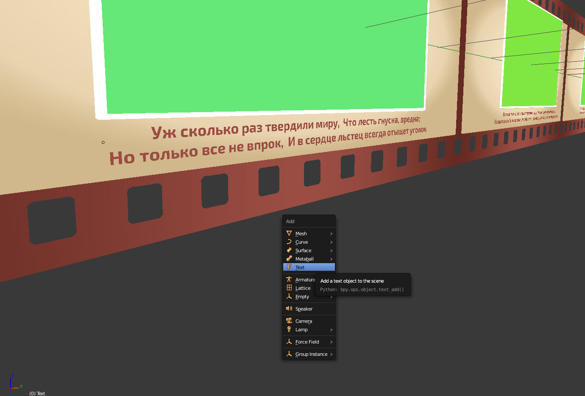
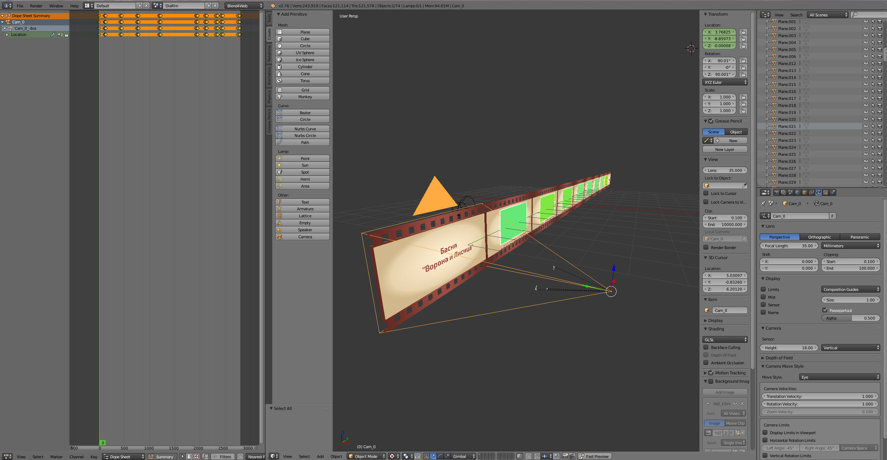
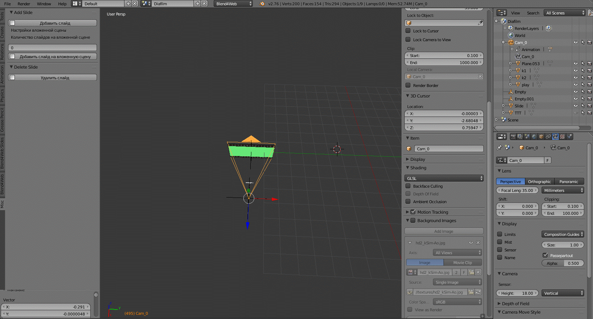

*************************************************
Creating 3D presentation with Blend4Web templates
*************************************************

Intro
=====

Each of us has to create presentation sometimes, in this case you oftenly use special editors like Powerpoint. However, techology doesn`t stand still and today you can create fully functional 3D web presentations. Unfortunately, only professional painters and programmers is able to do such a thing. We decide to simplify this hard task and make almost all routine for slide management automation in Blender, that is allows you concentrate on creation and fresh ideas. In current lesson we will show you how to work with "Slidefilm" template, designed as a film strip. The template can be used for creating of interesting story for kid as well as for business presentation in unusual format.

How to use "Slidefilm" template
===============================

Proper use of the template demand last version of Blend4Web. Open "Slidefilm" template file and click "Run scripts" button for appearing neccesary template`s buttons. You need to do it only once, next time file will be opened with buttons.

.. image:: images/11.jpg

Next, create new scene by clicking "Add slide" button, new slide will be place for automatically generated new scene. Camera animation for moving between scenes will be automatically generated too. Also in slide added pre-made navigation button (“play”, “left” and “right”). Logic tree will be re-generated after each slide adding and deleting.

If you open a list of scenes in the top toolbar, then you can see a new scenes, select it for switch from scene to scene depending on what actions are needed in the future. For example, we have added low-poly decoration sets and two character of well-known fable about the crow and the fox. In each scene minimum camera animation. You can use our template to build a completely new story that has to be suitably framed and ready logic. In fact, our template is a quick tool for creating beautiful and at the same time easy 3D presentation, which you can send to anyone. And receiver will be able to open it in browser without any plug-ins.

We use standard Blender tools for adding the necessary objects in the scene. Either we can create this objects from scratch, depending on the goals of the presentation.

.. image:: images/3.5.jpg

.. image:: images/3.jpg

You can fast and easy transfer objects from one scene to another with standard Ctrl+C / Ctrl+V methods

Next, click Shift+A and type caption for every slide.

.. image:: images/4.jpg

Addition another slide will create animation of camera movement. In the figure shows automatically generated animation keys. You can start and stop animation with Alt+A.

In the script we solve most difficulty tasks and present you space for creation and make your own ideas a reality. Удачных проектов!

What includes in template
=========================

The template for creating 3D presentations designed to simplify the process of creating presentations in a blender

The template is written in Python and uses the api blend4web and api blender

The template allows you to automate three processes:
	* Creating a slide and placement of service objects to move the camera and the creation of the complex scene
	* Creating logic tree for navigating through slides
	* Creating animation keys for the autoplay mode

1) Slide creation
-------------------

For slides and service objects creating are used class AddSlideClass

By default template is already include the initial slide

so we just need to duplicate the initial slide with offset and rename it.

Object copying with offset occurs by using function::

	bpy.ops.object.duplicate_move(TRANSFORM_OT_translate={"value":(0, obj.dimensions[0] * l, 0)})

Service objects with "Empty" type creates by function::

	bpy.ops.object.empty_add(type='PLAIN_AXES', radius=2, view_align=False, location=(obj.location[0],obj.location[1],obj.location[2] ))

We need 2 Empty object, first in the middle of slide object, second placed on distance 3.2 by X axes from middle of slide object.

Creation sub-scene can be carried out using function::

	bpy.ops.scene.new()

Notice that each slide should show its sub-scene, so each slide should have a unique material with reference to a sub-scene

We can do this by copy the texture and material of the original slide (to inherit their property) and assign the resulting material and texture to the new object::

	new_material = bpy.data.materials['имя материала'].copy()

	cTex = bpy.data.textures[‘имя текстуры’].copy()

2) Logic tree creation
----------------------

.. image:: images/22.jpg

The logical tree to control the scene consists of three branches, which already in the template.

The first two are responsible for the changeover from autoplay to manual shifting and vice versa.

A third is designed for switching slides to right and to left.

It is already well built and running, but for only one slide.

If you add new slide, then node tree will be rebuild with 2 new nodes and keep running.

All of this manipulation doing by fuction add_logic_nodes from AddSlideClass.

3) Creating animations
----------------------

Autoplay mode needs the camera animation, which at certain intervals of time will move between slides.

Animations is created with class AddAnimation.

After creating each slide is called a class "execute" and with the function::

	bpy.context.scene.frame_set(frame_num)
           camera.location[0] = position[0] + 2
           camera.location[1] = position[1]
           camera.location[2] = position[2]
           camera.keyframe_insert(data_path="location", index=-1)

to camera will be added animation keys, three on slide.

.. image:: images/4.jpg

Resume
======

In the end, we get the full 3D web application with our presentation. Based on executed work we can conclude that the creation of a full 3D presentation - not so complicated process that is available to a wide range of passionate enthusiasts.

Video lesson is available on youtube.com

Download the template and a ready example of the presentation from GitHub at `<https://github.com/wantbook/3DSlides>` _ (distributed under the MIT open source license). Set of templates will be expend over time, allowing you to create not only a "film" presentation, but also magazines, art expositions and galleries.