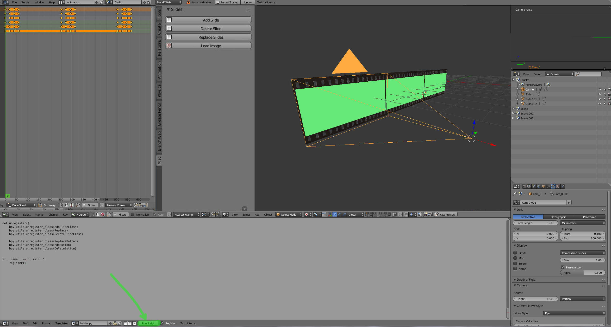
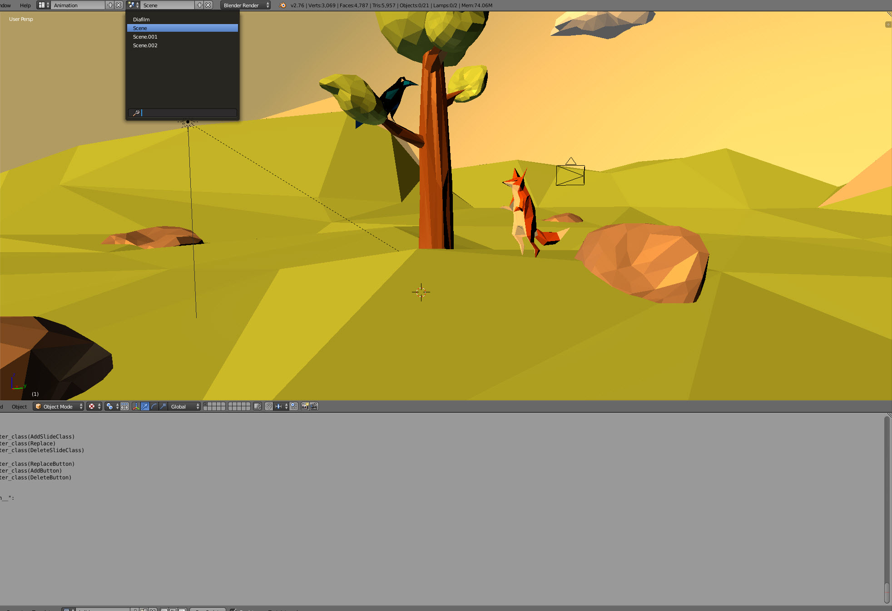
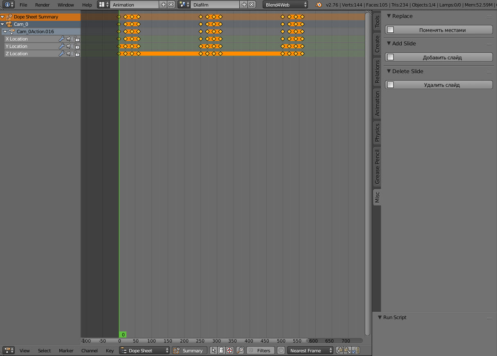
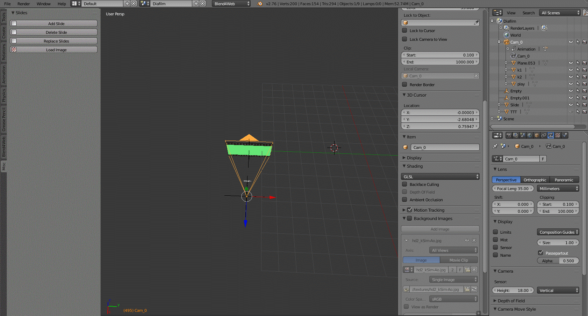
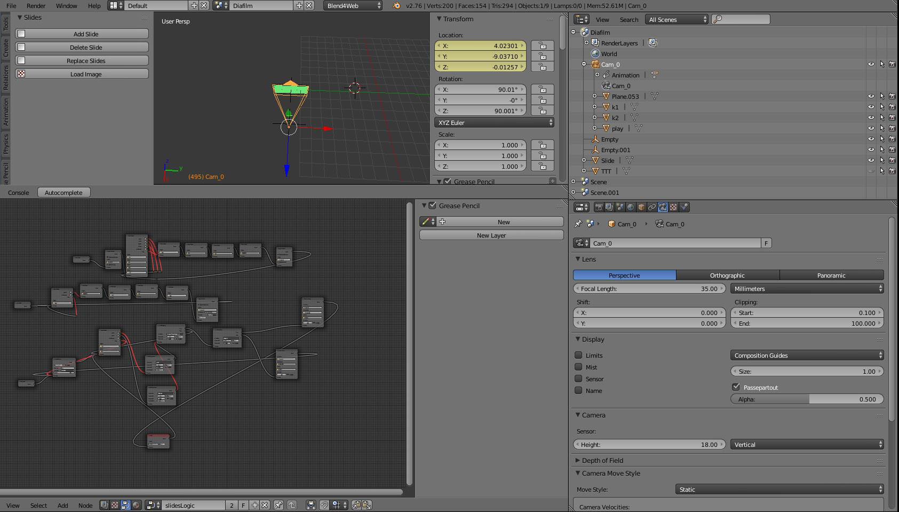

*********************************************
Создание 3D презентации на шаблонах Blend4Web
*********************************************

Введение
========

Каждому из нас порой приходится создавать презентации, и часто выручают редакторы на подобии PowerPoint.  Однако, технологии не стоят на месте, и сегодня уже можно создавать полноценные 3D веб презентации. Правда пока это доступно лишь профессиональным художникам и программистам. Мы решили упростить эту сложную задачу и сделали почти всю рутинную работу по автоматизации управления слайдами в редакторе Blender, позволяя вам сосредоточиться на творчестве и интересных идеях. В данном уроке мы демонстрируем работу шаблона «FILM», построенного на подобии кинопленок с диапозитивами. Шаблон можно использовать как для создания интересных детских историй, так и для деловых презентаций в необычном представлении.

Работа с шаблоном
=================

Для корректного использования шаблона необходима последняя версия Blend4web. При открытии файла шаблона «FILM» нажимаем кнопку Run Scripts для добавления кнопок активации сцен, их перестановки и удаления. Делается это только раз, в дальнейшем файл будет открываться уже с кнопками.

Далее для того,  чтобы создать новую сцену, нажимаем кнопку «добавить слайд» и к нему автоматически будут  добавляться  сцены. Анимация камеры будет генерироваться автоматически, выстраивая движение перехода от слайда к слайду. Так же уже созданы навигационные кнопки взаимодействия со сценой в конечном варианте blend4web-а, “play” “left” “right” Дерево логики будет генерироваться автоматически в зависимости от того, сколько вы добавили новых слайдов.

Если вызвать список сцен в верхнем тулбаре, то можно заметить уже созданные новые, нажимая на которые можно переключаться от сцены к сцене в зависимости от того, какие в дальнейшем требуются манипуляции. Мы, например, добавили low-poly декорации и двух персонажей известной басни про ворону и лисицу. В каждой сцене минимальная анимация камеры. Можете воспользовавшись нашим шаблоном построить свою, совершенно новую историю которая уже будет соответствующе оформлена и с готовой логикой. По сути наш шаблон является быстрым инструментом для создания красивой и в то же время легкой 3D презентации, которую можно отправить любому человеку. И он, без каких либо плагинов, будет способен открыть ее в своем браузере.

.. image:: images/2.jpg

Чтобы добавить необходимые объекты в сцену мы пользуемся штатными средствами Блендера. Либо создаем их с нуля, в зависимости от поставленных целей от презентации. 

.. image:: images/3.5.jpg

Для легкого и быстрого переноса объектов из сцены в сцену можно их копировать стандартными способами Ctrl+C и Ctrl+V

.. image:: images/4.5.jpg

После нажимаем Shift+A  и добавляем необходимый текст под каждый слайда. 

Далее для создания анимации перехода между слайдами вы просто создайте еще один слайд. Так выглядят ключи анимации камеры, как уже было сказано, они генерируются автоматически. Для проигрывания анимации нажмите Alt+A и так же для ее остановки. 

.. image:: images/5.jpg

Все самые сложные операции мы заранее реализовали в скрипте, а для вас оставили только пространство для творчества и реализации ваших идей. Удачных проектов!

Как устроен шаблон
==================

Шаблон для создания 3д презентаций предназначен для упрощения процесса создания презентаций в blender

Шаблон написан на языке Python и использует api blend4web и api blender. 

Шаблон позволяет автоматизировать три процесса:
	* Создание слайда и расстановка служебных объектов для перемещения камеры и создание сложенной сцены
	* Создание логических деревьев для осуществления навигации по слайдам
	* Создание ключей анимации для режима автоматического проигрывания

1) Создание слайдов
-------------------

За создание слайдов и служебных объектов отвечает класс AddSlideClass

По умолчанию в шаблоне уже  присутствует начальный слайд

поэтому нам нужно просто продублировать начальный слайд со смещением и назвать его по-новому.

Копирование объектов со смещением происходит с помощью функции::

	bpy.ops.object.duplicate_move(TRANSFORM_OT_translate={"value":(0, obj.dimensions[0] * l, 0)})

Создание служебных объектов типа “Empty” происходит с помощью функции::

	bpy.ops.object.empty_add(type='PLAIN_AXES', radius=2, view_align=False, location=(obj.location[0],obj.location[1],obj.location[2] ))

Нам понадобятся два Empty один в центре объекта, а один на расстоянии 3.2 от центра по оси X.

Создание вложенной сцены можно осуществить с помощью функции::

	bpy.ops.scene.new()

Так же стоит отметить, что, так как на каждом слайде должна показываться своя вложенная сцена, каждый слайд должен обладать уникальным материалом со ссылкой на вложенную сцену.

Для этого мы копируем текстуру и материал исходного слайда (чтобы унаследовать их свойства) и присваиваем получившиеся материал и текстуру новому объекту::

	new_material = bpy.data.materials['имя материала'].copy()

	cTex = bpy.data.textures[‘имя текстуры’].copy()

2) Создание логических деревьев
-------------------------------

Логическое дерево для управления сценой состоит из трех ветвей.

Все три ветви уже есть в шаблоне.

Первые два отвечают за переключение режимов с автоматического проигрывания на ручное переключение и наоборот.

А третье предназначено для навигации по слайдам при переключении вправо и влево.

Оно уже правильно построено и работает, но для одного слайда.

Таким образом, при добавлении нового слайда, в это дерево автоматически добавляется две новые ноды, после чего восстанавливается целостность и работоспособность дерева.

За эти операции отвечает функция add_logic_nodes принадлежащая классу AddSlideClass

3) Создание анимации
--------------------

Для режима автоматического проигрывания нам потребуется анимация камеры, которая с определенными промежутками времени будет перемещаться между слайдами.
За создание анимации отвечает класс AddAnimation.
После создания каждого слайда вызывается функция класса execute и с помощью функций::

	bpy.context.scene.frame_set(frame_num)
           camera.location[0] = position[0] + 2
           camera.location[1] = position[1]
           camera.location[2] = position[2]
           camera.keyframe_insert(data_path="location", index=-1)

для камеры пробиваются ключи перемещения, по три на слайд.

Выводы
======

В конечном итоге мы получаем полноценное 3D веб приложение с нашей презентацией. Исходя из проделанной работы можно сделать вывод, что создание полноценной 3D презентации – не такой уж и сложный процесс, доступный широкому кругу увлеченных энтузиастов. 

Видео-демонстрация урока доступна на youtube.com.

Скачать шаблон и готовый пример презентации можно с GitHub по адресу `<https://github.com/wantbook/3DSlides>`_ (распространяется по открытой лицензии MIT). Состав шаблонов будет со временем пополняться, позволяя создавать не только «пленочные» презентации, но и журналы, художественные экспозиции и галереи.
