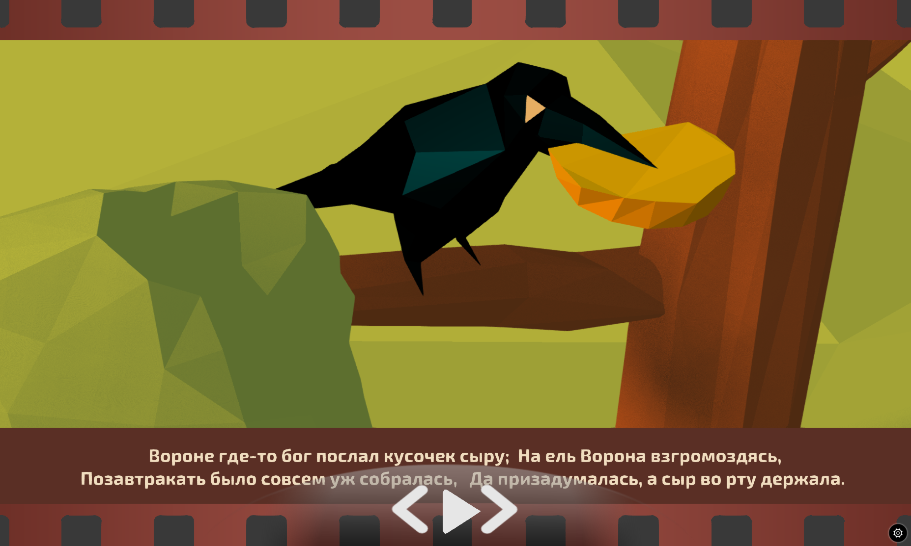

**************************************************
Creating 3D presentations with Blend4Web templates
**************************************************

Intro
=====

We all have to create presentations at times. In these cases, you often use specific editors such as Powerpoint. However, technology moves forward and today it`s possible to create fully functional 3D web presentations. Unfortunately, this has been limited to only professional graphic artists and programmers. We decided to simplify this difficult task, and we did almost all the routine work for slide management automation in Blender, which allows you to concentrate on creativity and fresh ideas. In this lesson, we will show you how to work with the "FILM" template, designed as a filmstrip. The template can be used for creating interesting kids` stories as well as business presentations in a novel format.

		Fig. 1 Fable "The crow and the fox"

		`Open an examle <http://triumphllc.github.io/3DSlides/B4W-template-FILM/B4W-template-FILM-example1.html>`_

Working with the "FILM" template
================================

Proper use of the template requires the latest version of Blend4Web. Open the "FILM" template file and click the "Run scripts" button to make the add, swap, delete and upload buttons appear. You will need to do this only once; next time the file opens with buttons.

.. figure:: images/11.jpg
		:scale: 80 %
		:align: center
		:alt: Fig. 2 Location of “Run scripts” button

		Fig. 2 Location of “Run scripts” button

Next, create a new scene by clicking the "Add slide" button; an automatically generated new scene will be added to a new slide. Camera animation for moving between scenes will be automatically generated as well. The navigation buttons “play”, “left” and “right” to interact with a scene in the blend4web application are also created. A logic tree will be automatically generated depending on the number of new slides added.

If you open a list of scenes in the top toolbar, then you can see new scenes. By clicking on them, you can switch from scene to scene depending on what future actions are required. For example, we have added low-poly decoration sets and two characters of the well-known fable about the crow and the fox. There is minimum camera animation in each scene. You can use our template to build a completely new story, which already includes the appropriate frame and prepared logic. In essence, our template is a quick tool for creating a beautiful and at the same time lightweight 3D presentation, which you can send to anyone. The receiver will be able to open and view it in a browser without plug-ins.

.. figure:: images/2.jpg
		:scale: 80 %
		:align: center
		:alt: Fig. 3 List of new scenes

		Fig. 3 List of new scenes

In order to add the necessary objects in the scene we use standard Blender tools. Or, we can create these objects from scratch, depending on the goals of the presentation.

.. figure:: images/3.5.jpg
		:scale: 80 %
		:align: center
		:alt: Fig. 4 Adding objects

		Fig. 4 Adding objects

.. figure:: images/3.jpg
		:scale: 80 %
		:align: center
		:alt: Fig. 5 Copying objects

		Fig. 5 Copying objects

You can quickly and easily transfer objects from one scene to another using the standard Ctrl+C / Ctrl+V methods

.. figure:: images/4.5.jpg
		:scale: 80 %
		:align: center
		:alt: Fig. 6 Adding caption to slide

		Fig. 6 Adding caption to slide

Next, click Shift+A and type a caption for every slide.

.. figure:: images/4.jpg
		:scale: 80 %
		:align: center
		:alt: Fig. 7 Automatically generated animation keys

		Fig. 7 Automatically generated animation keys

Create another slide to create animation of camera movement between slides. Fig. 7 shows automatically generated camera animation keys. You can start and stop animation with Alt+A.

.. figure:: images/5.jpg
		:scale: 80 %
		:align: center
		:alt: Fig. 8 Final results

		Fig. 8 Final results

We solve most difficult tasks in the script and leave you with space for creativity and making your own ideas a reality. Good luck with your projects!

What is in the template
=======================

The template for creating 3D presentations is designed to simplify the process of creating presentations in blender

The template is written Python and uses both the blend4web api and blender api

The template allows you to automate three processes:
	* Creating a slide and placing service objects to move the camera and create a complex scene
	* Creating a logic tree to navigate through slides
	* Creating animation keys for the autoplay mode

1) Creating a slide
-------------------

AddSlideClass is used to create slides and service objects 

By default, the template already includes the initial slide

.. figure:: images/111.gif
		:scale: 80 %
		:align: center
		:alt: Fig. 9 Template with initial slide

		Fig. 9 Template with initial slide

so we just need to duplicate the initial slide with an offset and rename it.

Copying objects with offsets is done by using the following function::

	bpy.ops.object.duplicate_move(TRANSFORM_OT_translate={"value":(0, obj.dimensions[0] * l, 0)})

"Empty" service objects are created by the following function::

	bpy.ops.object.empty_add(type='PLAIN_AXES', radius=2, view_align=False, location=(obj.location[0],obj.location[1],obj.location[2] ))

We need two “Empty” objects, the first in the center of the slide object, the second is placed at a distance of 3.2 on the X-axis from the center of the slide object.

Creating a sub-scene can be carried out using the following function::

	bpy.ops.scene.new()

Notice that each slide should show its own sub-scene, so each slide should have a unique material with reference to a sub-scene

We can do this by copying the texture and material of the original slide (to inherit their properties) and assign the resulting material and texture to the new object::

	new_material = bpy.data.materials['material name'].copy()

	cTex = bpy.data.textures[‘texture name’].copy()

2) Creating logic trees
-----------------------

.. figure:: images/22.jpg
		:scale: 80 %
		:align: center
		:alt: Fig. 10 Logic tree for initial slide

		Fig. 10 Logic tree for initial slide

The logical tree to control the scene consists of three branches, which are already in the template.

The first two are responsible for the switching between autoplay and manual mode.

The third is designed to navigate by slide to the right and to the left.

It is already built correctly and running, but for only one slide.

If you add a new slide, then two new nodes will be automatically added to logic tree, after which integrity and operability of the logic tree are restored.

The add_logic_nodes function from AddSlideClass is responsible for these operations.

3) Creating animations
----------------------

Autoplay mode needs camera animation, which at certain intervals of time will move between slides.

Animation is created with the AddAnimation class.

After creating each slide, the "execute" class is called and with the function::

	bpy.context.scene.frame_set(frame_num)
           camera.location[0] = position[0] + 2
           camera.location[1] = position[1]
           camera.location[2] = position[2]
           camera.keyframe_insert(data_path="location", index=-1)

animation keys, three on each slide, will be added to the camera.

.. figure:: images/4.jpg
		:scale: 80 %
		:align: center
		:alt: Fig. 11 Automatically generated animation keys

		Fig. 11 Automatically generated animation keys

In conclusion
=============

In the end, we get a complete 3D web application with our presentation. Based on executed work we can conclude that the creation of a complete 3D presentation – is not such a complicated process and is available to wide range of passionate enthusiasts.

A video lesson is available on youtube.com

Download the template and a prepared example of the presentation from GitHub at `<https://github.com/TriumphLLC/3DSlides>` _ (distributed under the MIT open source license). A set of templates will be expanded over time, allowing you to create not only a "film" presentation, but also magazines, art expositions and galleries.
