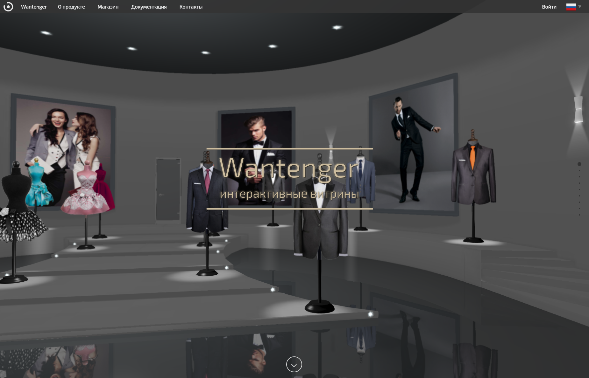

***********************************************************
Создание конфигуратора товаров на Blend4Web шаблоне PRODUCT
***********************************************************

Введение
========

Живая демонстрация товара всегда позволяет потребителям посмотреть на покупку со всех сторон - примерить, поиграть, компоновать опции. Без достаточного количества информации покупателям сложно принимать решения о приобретении товаров. Но с трехмерной конфигурируемой моделью товара все становится интереснее. Blend4Web шаблон "PRODUCT" позволяет создавать зрелищные экспозиции товаров, наполнять их различными опциональными деталями, наборами материалов для различных поверхностей.

Главной особенностью шаблона является возможность обычному художнику настроить наборы опций в редакторе Blender, сопоставить ценовые варианты и одной кнопкой получить веб-приложение. Такое приложение можно подключить к собственному сайту или интернет магазину в облаке Wantenger.com.

.. image:: images/1.png
		:scale: 80 %
		:align: center
		:alt: Рис. 1 Пример веб-приложения
		:target: http://triumphllc.github.io/3DSlides/B4W-template-PRODUCT/viewer/index.html?load=preview.json 

Рис. 1 Пример веб-приложения

`Открыть пример <http://triumphllc.github.io/3DSlides/B4W-template-PRODUCT/viewer/index.html?load=preview.json>`_

Работа с шаблоном
=================

Для корректного использования шаблона необходима последняя версия Blend4web. При открытии файла шаблона "PRODUCT" выбираем в списке файлов шаблона conf.py и нажимаем кнопку "Run Script".

.. image:: images/2.png
		:scale: 80 %
		:align: center
		:alt: Рис. 2 Панель Configurator

Рис. 2 Панель Configurator

В появившейся панели Configurator нажмите кнопку Elements для вызова списка секций. Для добавления секции в список нажмите в нем кнопку Add. Каждая секция предназначена для хранения одинаковых по функционалу опций (например каблуки обуви, двери автомобилей или материалы из кожы). Секции могут быть двух типов - секция объектов и секция материалов. По-умолчанию создаётся секция объектов, для смены её типа в списке секций нажмите у нужной секции кнопку настроек (бутерброд) и в появившемся меню поставте галочку в чекбоксе "is material". Визуально, в списке секций, секции разного типа отличаются иконкой.

.. image:: images/3.png
		:scale: 80 %
		:align: center
		:alt: Рис. 3 Список секций

Рис. 3 Список секций

Для переименования секции нужно кликнуть по меню секции (кнопка-бутерброд), в выпавшем меню выбрать Rename и в появившемся поле ввода ввести имя секции.

Для удаления секции нужно кликнуть по меню секции (кнопка-бутерброд) и в выпавшем меню выбрать Delete.

Для изменения положения секции в списке секций нужно кликнуть по меню секции (кнопка-бутерброд) и в выпавшем меню выбрать Move top для сдвига на первую позицию, Move up для сдвига вверх, Move down для сдвига вниз или Move bottom для сдвига в нижнюю позицию.

.. image:: images/4.png
		:scale: 80 %
		:align: center
		:alt: Рис. 4 Меню секции

Рис. 4 Меню секции

Объекты и материалы могут быть созданы в секции или добавлены в неё. 

Для создания нового элемента секции войдите внутрь секции и нажмите кнопку Add. В списке элементов секции появится новый объект, а в трехмерном редакторе появится единичный кубик. Если секция содержит материалы, то для добавления материала достаточно натянуть его на появившийся кубик. Если секция содержит объекты, то единичный кубик надо превратить в объект.

.. image:: images/5.png
		:scale: 80 %
		:align: center
		:alt: Рис. 5 Список элементов

Рис. 5 Список элементов

Для добавления нового элемента в секцию нужно загрузить объект из blend проекта нажав кнопку "Append new item" (аналогично функционалу Append). Когда загруженный объект появится в трехмерном редакторе, нужно кликнуть по нему левой кнопкой мыши и в появившемся списке выбрать нужную секцию. После этого объект будет добавлен в список элементов выбранной секции.

Для переноса элементов из секции в секцию нужно выбрать элемент в списке элементов секции, когда он появится в трехмерном редакторе кликните по объекту левой кнопкой мыши и в появившемся списке выберите новую секцию.

.. image:: images/6.png
		:scale: 80 %
		:align: center
		:alt: Рис. 6 Выпадающий список секций для объекта

Рис. 6 Выпадающий список секций для объекта

Удаление элемента из секции производится аналогично переносу элементов, но в списке нужно выбрать вариант "Clear section".

Для переименования элемента надо выбрать элемент и в появившемся над кнопками json editor-a в панели Tools поле ввода ввести новое название.

.. image:: images/7.png
		:scale: 80 %
		:align: center
		:alt: Рис. 7 Переименование объектов и секций

Рис. 7 Переименование объектов и секций

Важным элементом шаблона является возможность настроить совместимость объектов и материалов между собой, например указать что с этим каблуком сочетаются только эти стельки и эти материалы, или же что раскладная крыша доступна только для определенных кузовов машины.

Для настройки совместимости элемента нужно нажать на кнопку-бутерброд этого элемента. Далее откроется список секций, заходя в которые и, выставляя или снимая чекбоксы у элементов этих секций, указать совместимость начального элемент с остальными. 

.. image:: images/8.png
		:scale: 80 %
		:align: center
		:alt: Рис. 8 Настройка совместимости

Рис. 8 Настройка совместимости

После настройки совместимости элементов можно указать цены для всех совместимых сочетаний объектов и материалов. Такой список создаётся в Blend4Web нажатием кнопки "PriceList". После её нажатия в списке файлов появляется prices.json в котором в json-формате выводится список всех совместимых пар объект-материал и поле для ввода цены такой пары. Валюта задаётся для всего списка цен в поле "currency" в конце файла.

.. image:: images/10.png
		:scale: 80 %
		:align: center
		:alt: Рис. 9 Файл prices.json

Рис. 9 Файл prices.json

Вы можете оценить получающееся у вас приложение с помощью кнопки "Preview". После нажатия на неё в браузере по-умолчанию откроется html-страница содержащая приложение с вашими объектами и материалами. В интерфейсе приложения несовместимые с текущим выбором объекты и материалы будут неактивны. Для смены объекта внутри секции достаточно кликнуть по желаемому объекту. Для смены материала примененного к объекту нужно навести курсор на его плашку и в появившемся меню выбрать пункт "Изменить", откроется список материалов в котором надо будет кликнуть желаемый материал.

.. image:: images/11.png
		:scale: 80 %
		:align: center
		:alt: Рис. 10 Предпросмотр конфигуратора

Рис. 10 Предпросмотр конфигуратора

Также после нажатия кнопки "Preview" в списке файлов добавляется файл conf.json содержащий матрицу совместимости элементов.

.. image:: images/9.png
		:scale: 80 %
		:align: center
		:alt: Рис.11 Файл conf. json

Рис. 11 Файл conf. json

По умолчанию для всех объектов и материалов, как в списке элементов секции, так и в приложении используется зашлушка. Нажатие кнопки "Screenshot all" вызывает функцию которая перебирает все объекты и материалы и делает их скриншоты, которые сохраняются в папку с проектом и отображаются вместо заглушки как в списке элементов секции, так и в приложении. Если вы хотите использовать собственные иконки, то просто подмените сгенерированные скриншоты своими картинками выбрав "Image upload" в меню материала. Простой способ сгенерировать свои икноки это создать их через браузер. Нажмите "Preview" и в открывшемся окне браузера нажмите кнопку "Make screenshots" в нижней части правой панели. Это сгенерирует скриншоты для каждого объекта и материала. Вы можете сохранить любой из них выбрав пункт "Download" в меню объекта в правой панели.

.. image:: images/12.png
		:scale: 80 %
		:align: center
		:alt: Рис. 12 Автогенерация иконок элементов

Рис. 12 Автогенерация иконок элементов

Чтобы избежать загромождения сцены созданными или загруженными объектами мы добавили кнопку "Hide all elements", которая скрывает на 3D сцене все активные в данный момент объекты. Сами объекты при этом никуда не удаляются и могут быть вновь активированны через список элементов секции.

При нажатии кнопки "Export to Wantenger" происходит переименование объектов в понятный для Wantenger формат и открывается окно экспорта из Blender в формате "Blend4Web (.json)".

Подключение к интернет-магазину Wantenger.com
=============================================

После подготовки конфигуратора товаров с помощью шаблона Blend4web его можно подключить к магазину, например в системе Wantenger.com.

Рис. 13 Wantenger.com

Прежде всего, создайте архивный файл с вашим конфигуратором. Для этого нажмите кнопку "Export to Wantenger", экспортируйте проект из Blender и заархивируйте полученный набор файлов в один файл. При этом обратите внимание, что файлы должны лежать непосредственно в архиве, а не во вложенной папке. Для корректной обработки конфигуратора в системе Wantenger, при экспорте проекта надо указать имя logo.json.

.. image:: images/14.png
		:scale: 80 %
		:align: center
		:alt: Рис. 14 Экспорт и архивирование

Рис. 14 Экспорт и архивирование

Далее необходимо войти в аккаунт Wantenger и перейти в инструмент Веб-сайты. Создайте сайт на приложении Showcase, если у вас его ещё нет. Войдите в раздел Шоу-рум сайта, создайте секцию и добавьте в неё зал. После этого выберите созданный зал и перейдите к выбору 3D-модели. Над открывшимся редактором нажмите кнопку «Загрузить» и выберите архивный файл с вашим конфигуратором.

.. image:: images/15.png
		:scale: 80 %
		:align: center
		:alt: Рис. 15 Редактор шоу-рума

Рис. 15 Редактор шоу-рума

Если все объекты вручную именованы правильно (с префиксом product), либо проект выгружен кнопкой "Export to Wantenger", то товары автоматически попадут в список товарных мест шоу-рума. Кликнув по товарному месту в правом редакторе, вы откроете поиск по товарам из прайс-листа своего профиля, поиск с пустым поисковым запросом вернёт полный список товаров.

.. image:: images/16.png
		:scale: 80 %
		:align: center
		:alt: Рис. 16 Подключенный конфигуратор

Рис. 16 Подключенный конфигуратор

Теперь вы можете менять цены на запчасти в вашем конфигураторе без использования Blender и постоянных перезаливок конфигуратора на сервер, а пользователь может не только подобрать нужные опции товара, но и зарезервировать понравившийся набор.

Выводы
======

В итоге шаблон позволяет создать трехмерное веб-приложение показывающее товар в лучшем свете и подключить к нему систему обработки заказов, фактически с нуля создаётся полнофункциональная 3D карточка товара для автомобилей, одежды и обуви, предметов мебели и интерьера. Такая карточка является не просто замерзшим фотоснимком, а целой игрой для покупателей. В такой игре каждый сможет составить свою комбинацию опций с учетом личных предпочтений и получить индивидуальное предложение.

Скачать шаблон можно с GitHub по адресу https://github.com/TriumphLLC/3DSlides/archive/gh-pages.zip (распространяется по открытой лицензии MIT).