********************************************************************
Creating a product configurator with the Blend4Web template PRODUCT
********************************************************************

Intro 
A live demonstration of a product always allows customers to look at a purchase from all sides: try on, play with, combine options. Without enough information it’s difficult to a customer to make a decision about purchasing products. However, with a 3D configurable model of a product everything becomes more interesting. The Blend4Web “PRODUCT” template allows you to create spectacular product displays, fill them with various optional details, sets of materials for various surfaces.

The main feature of the template is possibility for ordinary artist to configure sets of options in the Blender editor, match price options and get a web application in one click. This kind of application can be connected to your own site or online store in the Wantenger.com cloud.

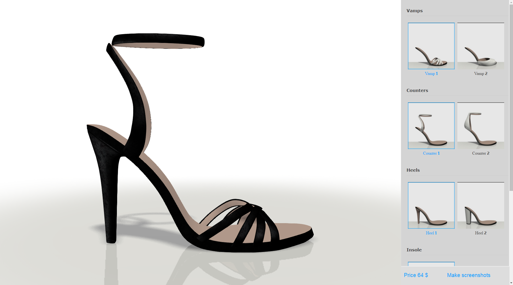

Fig. 1 Example of web application

`Open an example <http://triumphllc.github.io/3DSlides/B4W-template-PRODUCT/viewer/index.html?load=preview.json>`_

Working with the "PRODUCT" template
===================================

To correctly use this template you need the latest version of Blend4Web. Upon opening the “PRODUCT” template file, select conf.py from the list of template files and click “Run Script”.

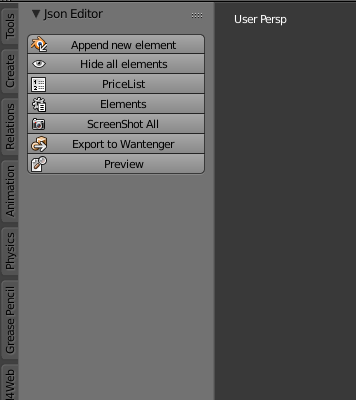

Fig. 2 Configurator panel

In the panel “Configurator” that appears click “Elements” to open a list of sections. To add a section to the list click “Add” in the list. Every section is designed to keep the same kinds of options (for example, heels for footwear, doors for vehicles or materials out of leather). Sections can be of two types – object or material. An object section is created by default. In order to change the section type, click the settings button (hamburger button) of the needed section and in the menu that appears check the “is material” checkbox. Visually, in the list of sections, sections of different types have different icons.

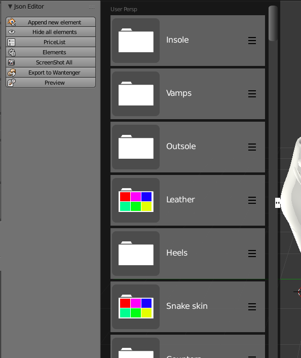

Fig. 3 List of sections

In order to rename a section, you need to select Rename in the drop down menu from the section menu (hamburger button) and enter the name of the section in the appearing field.
In order to delete a section, you need to select Delete in the drop down menu from the section menu (hamburger button).
In order to move the location of a section in the section list, in the drop down menu from the section menu (hamburger button), you need to select Move top to move it to the first position, Move up to move it up, Move down to move it down or Move bottom to move it to the lower position.

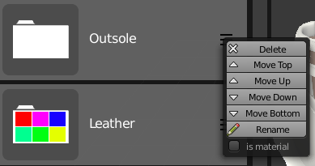

Fig. 4 Section menu

Objects and materials can be created in section or added to it.

In order to create a new element of a section, enter the section and click Add. A new object will appear in the element list of the section and in the 3D editor a unit cube will appear. If the section contains materials, to add material assign it to the appeared cube. If the section contains objects, the unit cube will need to be turned into an object.

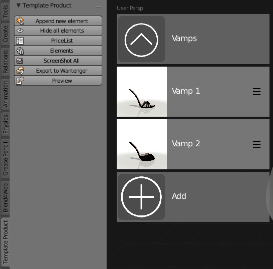

Fig. 5 Element list

In order to add a new element of a section, load an object from a blend project by clicking “Append new item” (same as Append). When the loaded object appears in the 3D editor, left click on the object and select the correct section in the appearing list. After which the object will be added to the element list of the selected section.

In order to move elements from section to section you need to select an element in the element list of a section, left click on the object when it appears in the 3D editor and select a new section in the appeared list.

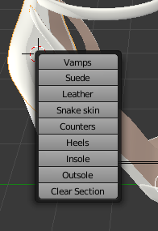

Fig. 6 Dropdown list of sections

Deleting an element from a section is done the same way as when moving elements except you select “Clear section” in the appeared list.

To rename an element you need to select the element and enter the new name in the field found on the Configurator panel above the Json Editor buttons.

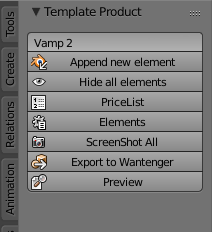

Fig. 7 Renaming objects and sections

An important element of a template is the possibility to configure the compatibility of objects and materials with each other, for example, to indicate that only these insoles and these materials match this heel or that a convertible top is only available for certain vehicle body types.

To configure the compatibility of an element you need to click the hamburger button of the element. Then, the list of sections will open and by entering the sections and checking or unchecking the checkbox of the elements of these sections indicate the compatibility of the configurable element with others.

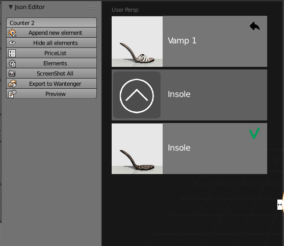

Fig. 8 Configuration of compatibility

Having configured the compatibility of elements you can show prices for all compatible matches of objects and materials. Such a list is created in the template by clicking “Pricelist”. prices.json, in which a json formatted list of all compatible object-material pairs and a line for a price of such a pair, will appear in the list of files. Currency is given in the “currency” line at the end of the file for the whole list of prices.

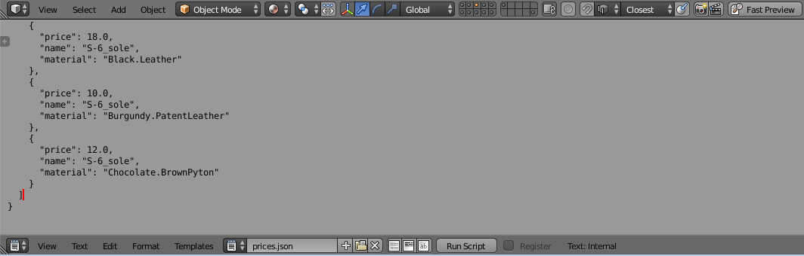

Fig. 9 prices.json

You can view your resulting application by pressing “Preview”. Your default browser will then open an html page that contains your application with your objects and materials. In the application interface objects and materials incompatible with the current options will be inactive. To change an object within a section, just click the desired object. To change applied material to an object hover over the object’s tile and select “Change” in the appearing menu. A list of materials will open from which you select the desired material.

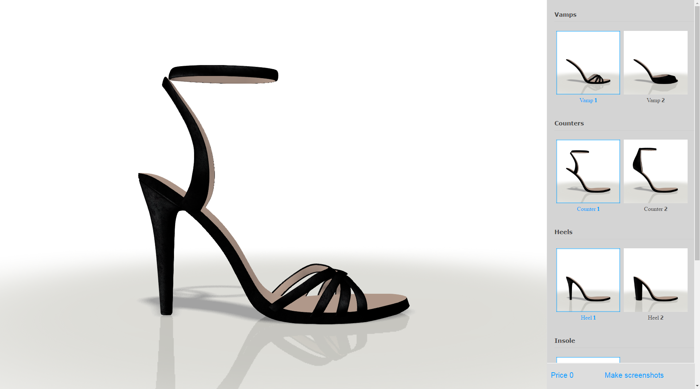

Fig. 10 Configurator preview

Also, after clicking the Preview button, a conf.json file that contains the matrix of element compatibility will be added to the file list. 

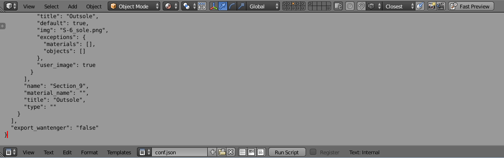

Fig. 11 conf.json

By default, a placeholder is used for all objects and materials, just as in the element list of sections, as well as in an application. Clicking “Screenshot all” launches a function that looks through all objects and materials and does screenshots which are saved in a folder with the blend project and are shown instead of the placeholder in the element list of sections as well as in the application. If you wish to use your own icons, then simply replace the generated screenshots with your own images by selecting "Image upload" in the item menu. A simple way to create these icons is making screenshots in the browser. Click "Preview" and in the window that opens click "Make screenshots" at the bottom of the right panel. This generates screenshots for all objects and materials. You can download these screenshots by clicking "Download" in the item menu in the right panel.

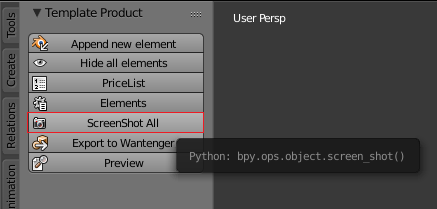

Fig. 12 Auto-generating icons of elements

To avoid overloading a scene with created or uploaded objects we added a “Hide all elements” button that hides all currently active objects in a 3D scene. The objects themselves are not deleted and can be activated through the element list of sections.

When clicking the Export to Wantenger button, objects are renamed in a format compatible to Wantenger and a window opens for exporting in the Blend4web (.json) Blender format.

Linking to your Wantenger.com online store
==========================================

After preparing your product configurator with the help of the Blend4Web template you can link it to your online store, for example in Wantenger.com.

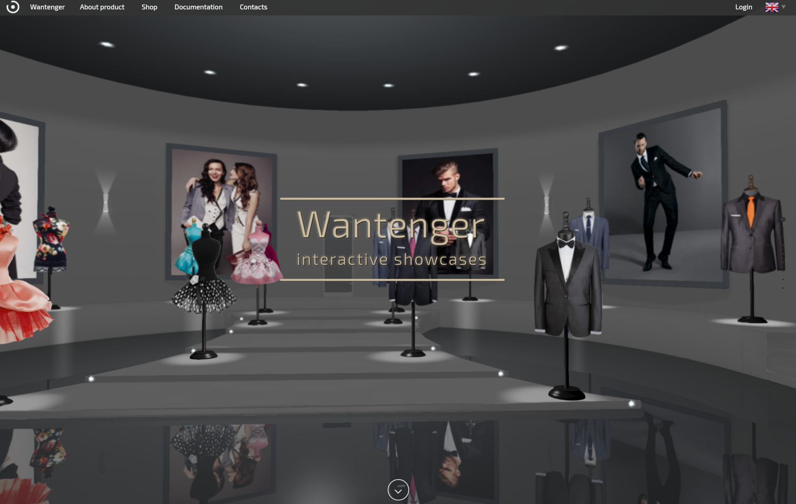

Fig. 13 Wantenger.com

First, create an archive file with your product configurator. In order to do this, click the Export to Wantenger button, export your project from Blender and archive the resulting set of files into one file. Note, that files must be directly in the archive, not in an enclosed folder. For proper integration in Wantenger upon exporting your project you will need to enter logo.json as the name of the resulting file.

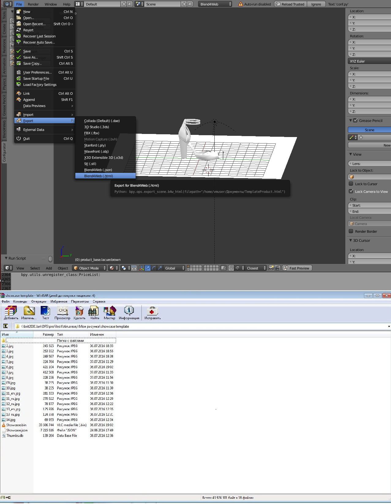

Fig. 14 Export and archive

Next, log in to your Wantenger account and go to the “Websites” tool. Create a site with the "Showcase" application if you don`t already have one. Go to the "Showroom" section of the site, create a section and add a room to it. After that choose the created room and move to 3D model selection. Click “Upload” above the opened editor and select the archived file with your product configurator.

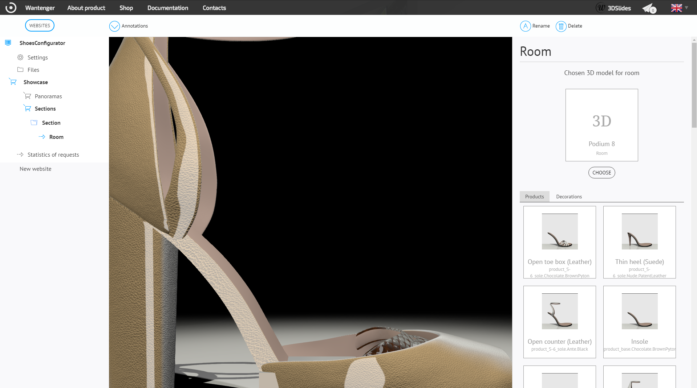

Fig. 15 Showroom editor

If all objects are properly named (with a product prefix for product objects), or the project is exported with the "Export to Wantenger" button, then products are automatically put in the product place list of the showroom. By clicking on a product place in the right editor you will open an editor to search by products in the pricelist of the current profile. A search with an empty request will return a full list of products. Select a product from the list and it will be linked with the chosen object from the configurator.

.. image:: images/16.png
		:scale: 80 %
		:align: center
		:alt: Fig. 16 Linked configurator

Fig. 16 Linked configurator

Now you can change prices for parts in your configurator without using Blender and constantly reloading a configurator, and a customer can not only select the desired product options but also reserve an appealing set.

Conclusion
==========

As a result, this template allows us to create a 3D web-application showing a product in the best light and link it to the order processing system, practically creating a fully-functional 3D product card for vehicles, clothes and footwear, furniture and interior items from scratch. This kind of card is not simply a frozen frame but a complete game for customers. In such a game everyone can set his own combinations of options while considering personal preferences and get a personalized offer.

Download the template and a prepared example of the presentation from GitHub at https://github.com/TriumphLLC/3DSlides/archive/gh-pages.zip (distributed under the MIT open source license). A set of templates will be expanded over time, allowing you to create not only a "film", "showcase" and "product" presentation, but also magazines, art expositions and galleries.
