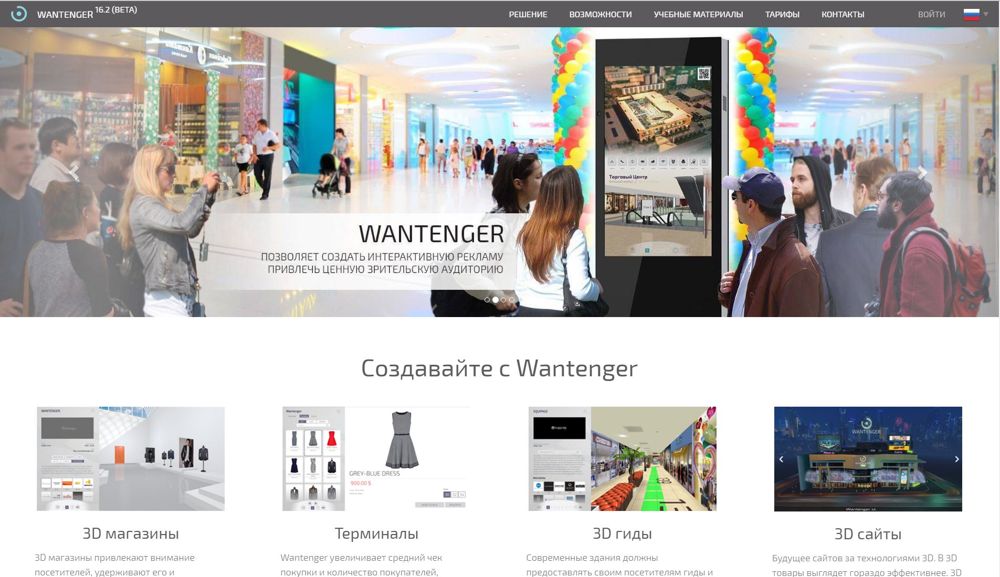
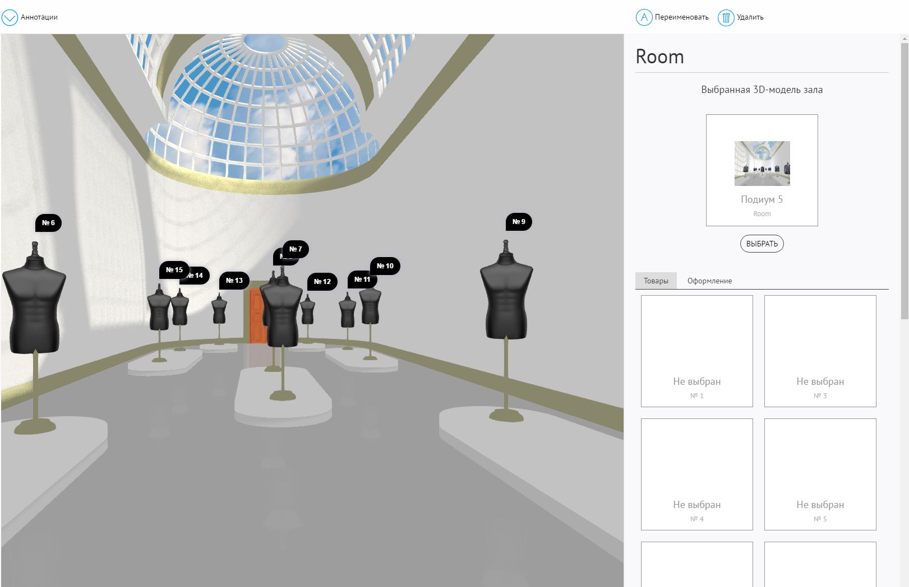

*************************************
Создание витрины на шаблоне Blend4Web
*************************************

Введение
========

Привлекательный дизайн витрин – одна из важнейших задач интернет торговли. Каталоги товаров с фотографиями и описанием обычно позволяют создать представление витрин. Но люди привыкли жить в трехмерном пространстве и рассматривать товары буквально со всех сторон. В рамках проекта с открытым кодом и свободным распространением 3DSlides мы подготовили новый Blend4Web шаблон «SHOWCASE» для гибкого конструирования трехмерных витрин с трехмерными товарами для демонстрации прямо на веб странице интернет магазина.

Главной особенностью шаблона является возможность для художника без привлечения программиста настроить витрины и линии для расстановки товаров. По точкам этих линий нажатием одной кнопки можно копировать заранее подготовленные формы товаров с последующим их оформлением. Шаблон включает в себя типовой набор шкафов, витрин и базовых форм товаров. 

.. figure:: images/1.jpg
    :scale: 80 %
    :align: center
    :alt: Рис. 1 Пример витрины
    :target: http://triumphllc.github.io/3DSlides/B4W-template-SHOWCASE/B4W-template-SHOWCASE-example1-en.html 

    Рис. 1 Пример витрины

    `Открыть пример <http://triumphllc.github.io/3DSlides/B4W-template-SHOWCASE/B4W-template-SHOWCASE-example1-en.html>`_

Работа с шаблоном
=================

Для корректного использования шаблона необходима последняя версия Blend4web. При открытии файла шаблона «SHOWCASE» нажимаем кнопку «Run Script» 

Обратите внимание, в нашем файле располагаются две сцены. Одна с матрицей объектов, вторая является главной. 

.. figure:: images/2.jpg
    :scale: 80 %
    :align: center
    :alt: Рис. 2 Сцена Library

    Рис. 2 Сцена Library

Если выбрать в списке сцен Library (библиотеку), то откроется сцена содержащая типовые шкафы, витрины и товары, именно сюда необходимо добавлять оформление шкафа, новую витрину или модель товара, которые вы хотите использовать в шаблоне. Вернемся к сцене Showcase (сборщик витрин), 

.. figure:: images/3.jpg
    :scale: 80 %
    :align: center
    :alt: Рис. 3 Сцена Showcase

    Рис. 3 Сцена Showcase

здесь осуществляется сборка витрины. Выделив любой объект на сцене и нажав точку,  мы осуществим быстрый переход к выбранному объекту и отцентровку камеры по нему. Также нажимая слеш (/) можно скрывать все объекты кроме выбранного или же снова их возвращать на сцену повтором операции. 

.. figure:: images/4.jpg
    :scale: 80 %
    :align: center
    :alt: Рис. 4 Переход к объекту и центровка камеры

    Рис. 4 Переход к объекту и центровка камеры

Далее мы создаем первый выставочный стенд, который состоит из шкафа и самой витрины. Выделив правой кнопкой мыши нужную нам витрину или шкаф, нажимаем кнопку на панели шаблона «Choose Showcase».  

.. figure:: images/5.jpg
    :scale: 80 %
    :align: center
    :alt: Рис. 5 Выбор шкафа

    Рис. 5 Выбор шкафа

При этом скрипт перебрасывает нас в основную сцену, где необходимо нажать «add Showcase» чтобы добавить выбранный объект в главную сцену. Для перехода к только что созданной витрине, необходимо выбрать ее из списка в левом верхнем выпадающем списке (Showcase). 

.. figure:: images/6.jpg
    :scale: 80 %
    :align: center
    :alt: Рис. 6 Выпадающий список витрин
    Рис. 6 Выпадающий список витрин

После создания нашего первого выставочного стенда, можно переходить к расстановке продукции на полках, а так же к ее более гибкой компоновке. Для этого необходимо выбрать полку в выпадающем списке с названием “Shelf”. Далее в двух следующих списках мы выбираем количество товаров на полке, а во второй линию расстановки ценников. 

.. figure:: images/7.jpg
    :scale: 80 %
    :align: center
    :alt: Рис. 7 Выпадающий список линий расстановки

    Рис. 7 Выпадающий список линий расстановки

Вы можете создавать самые разнообразные вариации компоновок, которые будут появляться в третьем списке под названием “Markup Line for prices”. 

Выбрав необходимую расстановку, мы создаем еще одну кривую с аналогичным количеством точек. Товары добавляются на полку таким же образом, как и создание новой витрины. Переходим на сцену с библиотекой объектов и, выделив нужный товар, жмем кнопку “Choose object”, 

.. figure:: images/8.jpg
    :scale: 80 %
    :align: center
    :alt: Рис. 8 Выбор товара

    Рис. 8 Выбор товара

перейдя к основной сцене проверяем, находимся ли мы на нужной полке в списке “Shelf”. Убедившись нажимаем “Add object” и товар автоматически добавится на выбранную полку. При повторе нажатия добавляется клон этого товара в следующую позицию на полке. При добавлении продукта автоматически создается и ценник, его позиция тождественна точкам кривой для ценников. 

Для удаления всех товаров на полке выбираем необходимую полку в выпадающем меню Shelf и нажимаем Clear shelf. Так же можно удалять витрины кнопкой Remove Showcase. 

После того, как вы расставили все необходимые товары на полках, можно переходить к редактированию цен. Нажимаем кнопку Export, и в нижнем окне Text editor создается список всех объектов и ценников под названием goods.json.

.. figure:: images/9.jpg
    :scale: 80 %
    :align: center
    :alt: Рис. 9 Goods.json

    Рис. 9 Goods.json

Внимательно сверяйте названия объектов в списке с названиями объектов в 3d сцене для избегания ошибок. Заполнив текстовую форму нужными ценами и названиями товаров необходимо нажать Update prices чтобы на ценниках в 3D сцене обновилась информация на актуальную. 

Если вам необходимо быстро поменять этикетку на товаре, воспользуйтесь кнопкой Load image. Выберите необходимую картинку, и в результате появится трехмерная плоскость с нужным изображением. Остаётся только поместить созданную этикетку на готовый товар. 

Как устроен шаблон
==================

Ценовой json файл называется goods.json и появляется в текстовом редакторе Blender после нажатия кнопки Export раздела Prices.

.. figure:: images/9.jpg
    :scale: 80 %
    :align: center
    :alt: Рис. 10 Goods.json

    Рис. 10 Goods.json

Json имеет следующую структуру 
::

  [{
    "name": "product_1_1_1",
    "price": "0",
    "currency": "руб"
    "id": "product_1_1_1"
  }]

Блок соответствующий каждому товару состоит из четырех ключей
  name — название товара отображаемое на ценнике
  price — цена товара
  currency — валюта цены товара
  id — идентификатор характеризующих положение товара в сцене Blender

Файл script_new.py содержит программный код шаблона и должен быть запущен в начале работы с шаблоном. В этом файле, в случае необходимости, программист может внести изменения в шаблон.

Прочие, возможно наличествующие, текстовые файлы генерируются Blender-ом или его плагинами и не относятся к шаблону.

Подключение к интернет-магазину Wantenger.com
=============================================

После подготовки витрины с помощью шаблона Blend4web её можно подключить к магазину, например в системе Wantenger.com. 

    Рис. 11 Wantenger.com

Прежде всего, создайте архивный файл с вашей витриной. Для этого экспортируйте из Blender все необходимые файлы и заархивируйте их в один файл. При этом обратите внимание, что файлы должны лежать непосредственно в архиве, а не во вложенной папке. 

.. figure:: images/12.jpg
    :scale: 80 %
    :align: center
    :alt: Рис. 12 Экспорт и архивирование

    Рис. 12 Экспорт и архивирование

Далее необходимо войти в аккаунт Wantenger и перейти в инструмент Веб-сайты. Создайте сайт на шаблоне Showcase, если у вас его ещё нет. Войдите в раздел Шоу-рум сайта, создайте секцию и добавьте в неё зал. После этого выберите созданный зал и перейдите к выбору 3D-модели. Над открывшимся редактором нажмите кнопку «Загрузить» и выберите архивный файл с вашей витриной. 

    Рис. 13 Редактор шоу-рума

Если все объекты именованы правильно (с префиксом product или productBillboard), то товары автоматически попадут в список товарных мест шоу-рума. Кликнув по товарному месту в правом редакторе, вы откроете поиск по товарам из прайс-листа своего профиля, поиск с пустым поисковым запросом вернёт полный список товаров. Кликните по товару, и если вы использовали productBillboard, то появится возможность выбрать картинку товара, которая будет отображаться, если же вы использовали в витрине трехмерные объекты с префиксом product, то поменяться только ценник. 

.. figure:: images/14.jpg
    :scale: 80 %
    :align: center
    :alt: Рис. 14 Подключенная витрина

    Рис. 14 Подключенная витрина

Теперь пользователь может не только осмотреть товары со всех сторон, но и зарезервировать понравившиеся.

Выводы
======

В итоге шаблон позволяет создать трехмерное веб-приложение показывающее товар в лучшем свете и подключить к нему систему обработки заказов, фактически с нуля создаётся полнофункциональный 3D веб магазин. 

С помощью шаблона Художник может быстро собрать витрину для оценки возникшей идеи, а также создать виртуальное представление товаров, показывающее их в самом выгодном свете.

Мерчендайзеры могут заблаговременно оценить, как товар будет смотреться на полке в той или иной обстановке, подобрать наиболее подходящее товару окружение или изменить сам товар под окружающие условия.

Покупателям открывается трехмерное пространство решений позволяющее увидеть товар «лицом» не заходя внутрь магазина или даже не вставая с дивана. Интерактивная витрина привлекает внимание к магазину вызывая по цепочке эффект толпы, а система заказов через интернет позволяет охватить людей точно знающих что им надо и ценящих своё время.

Скачать шаблон можно с GitHub по адресу https://github.com/TriumphLLC/3DSlides/archive/gh-pages.zip (распространяется по открытой лицензии MIT).