************************************************
Creating a showcase with the Blend4Web template.
************************************************

Intro
=====

An attractive showcase design is one of the most important things in online sales. Product catalogs with pictures and descriptions help visualize showcases. However, people are used to living in 3D space and looking at products literally from all sides. As part of the open-source and freely distributed project 3DSlides, we have prepared a brand new Blend4Web template called “SHOWCASE” for flexible constructing 3D showcases with 3D products to show right on a web page of an online store.

The main feature of this template is that the artist can set up a showcase and markup lines of products without the need to involve a programmer. With a click of a button you can copy previously prepared forms of products and paste them at the points of the markup line with the following setup of forms. This template includes a standard set of cupboards, showcase and basic product forms.

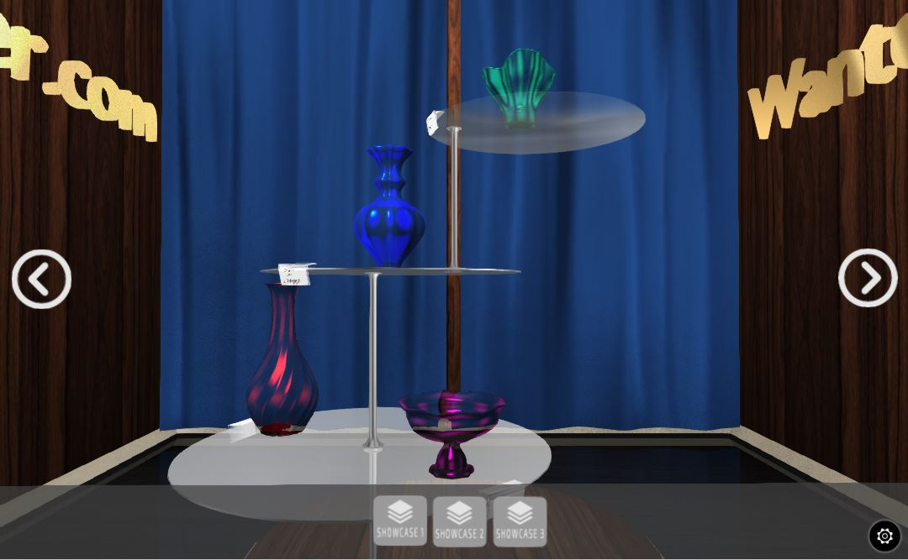

Fig. 1 Showcase of "Fit Fresh"

`Open an example <http://triumphllc.github.io/3DSlides/B4W-template-SHOWCASE/B4W-template-SHOWCASE-example1-en.html>`_

Working with the "SHOWCASE" template
====================================

To correctly use this template you need the latest version of Blend4Web. Upon opening the “SHOWCASE” template file click “Run Script”.

Note, there a two scenes in our file. The first (Library) consists of the matrix of objects, and the second (Showcase) is the main scene.

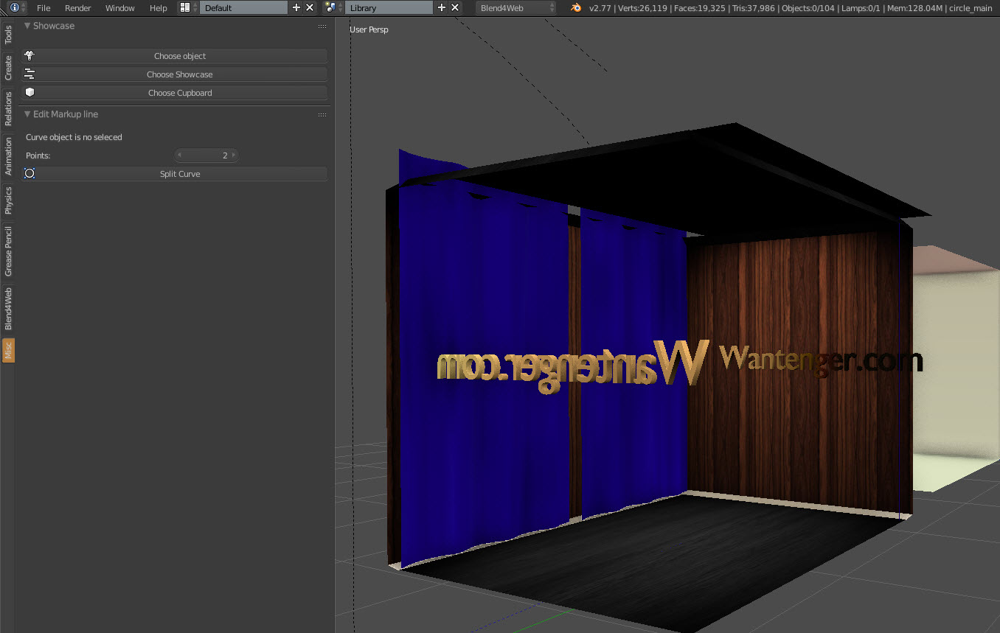

Fig. 2 Library scene

If we select Library in the list of scenes, then a scene containing standard cupboards, showcase and products will open, here is where you need to add the cupboard design, new showcase or product model you want to use in the template. Let`s return to the Showcase scene (showcase compiler) 

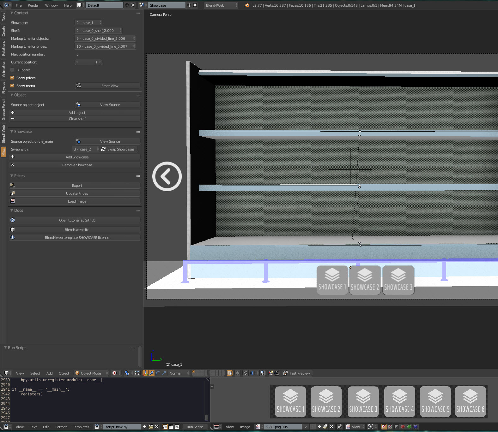

Fig. 3 Showcase scene

where showcase compilations take place. Selecting any object in the scene and pushing “NumPad Plus” we quickly move to the selected object and center camera on it. Also by pushing “forward slash” you can hide all objects except the selected one or return them to the scene by pushing “forward slash” once again.

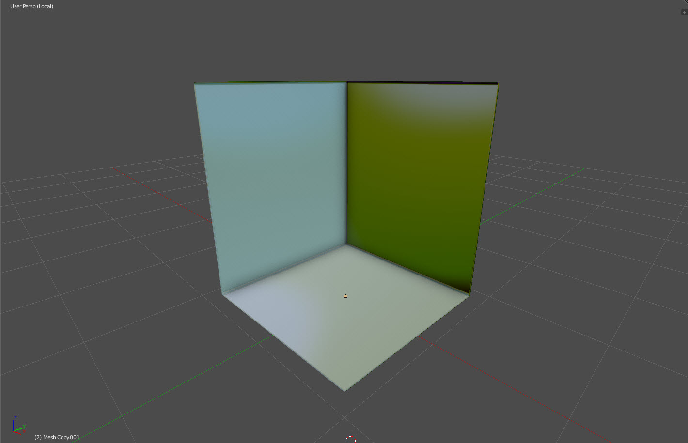

Fig. 4 Move and center camera to object

Next, we will create the first exhibition stand which consists of a cupboard and a showcase itself. Having selected the required showcase or cupboard with the right mouse button, we click “Choose Showcase” or “Choose cupboard” on template panel.

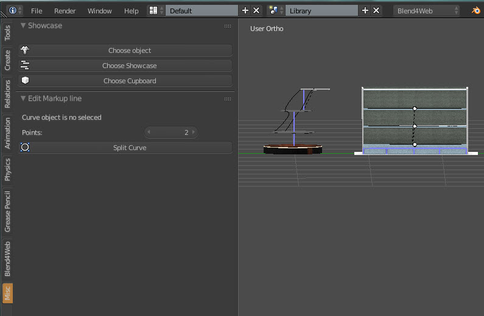

Fig. 5 Choice of cupboard

By doing so, the script redirects us to the main scene where you must click “Add showcase” to add the selected object to the main scene. In order to transfer to the showcase just created you will need to select it from the list in the upper left dropdown list.

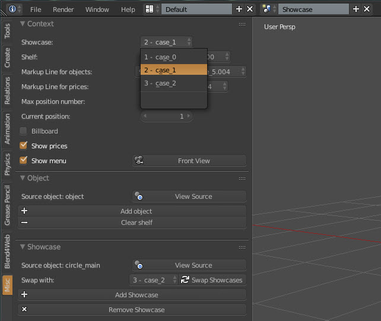

Fig. 6 Dropdown list of showcases

After our first exhibition stand has been created we can move on to placing products on the shelves as well as more flexible grouping. In order to do this select a shelf from the dropdown list called “Shelf”. Further in the next two lists we choose the number of products on the shelf and in the second the markup line for the placement of price tags. 

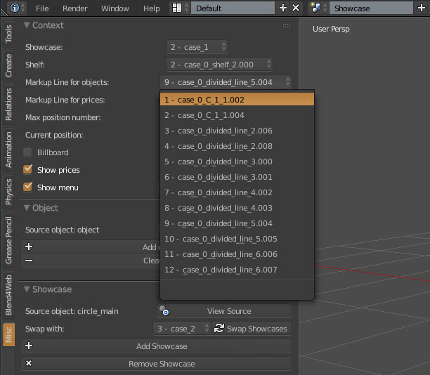

Fig. 7 Dropdown list of markup lines

You can create various placements which will be shown in the third list called “Markup line for prices”.

After choosing the required placement we create one more line with the same amount of points. Products are added to the shelf in the same manner as with the first showcase. Moving on to the Library scene and selecting the required product we click “Choose object” 

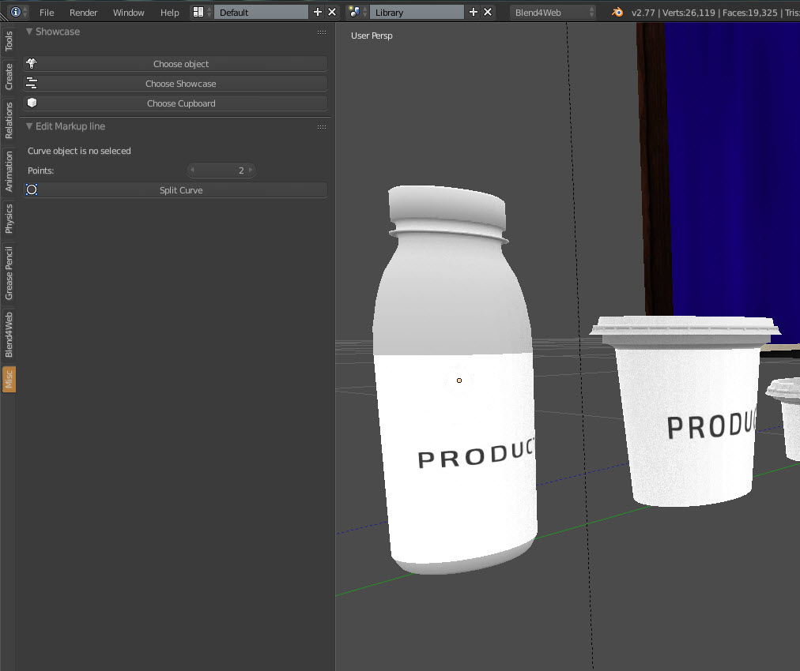

Fig. 8 Choice of object

which redirects us to the main scene. We check whether we are on the correct shelf in the “Shelf” list. After making sure we click “Add object” and a product is the automatically added in the chosen shelf. A copy of the product will be added to the next position on the shelf by clicking “Add object” again. A price tag is automatically created when adding a product and its position identical to the points of the markup line for prices.

In order to delete all products on  a shelf select the appropriate shelf in the dropdown menu “Shelf” and click “Clear shelf”. You can also delete a showcase by clicking “Remove Showcase”.

After you have placed all products on the shelves you can move on to price editing. Click “Export” and in the lower “Text editor” window a list of all objects and prices called goods.json is created. 

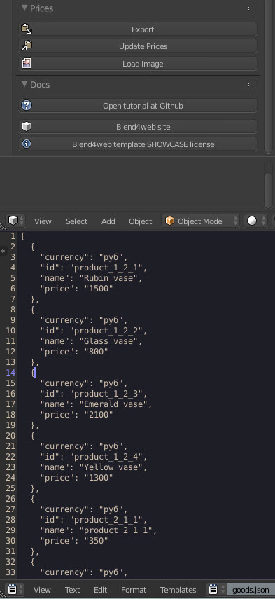

Fig. 9 Goods.json

Carefully check the names of objects in the list with the names of objects in the 3D scene to avoid the mistakes. Having the filled out the text form with the required prices and names of products you will need to press “Update prices” to update the price tags in the 3D scene with the current information.

If you need to quickly replace the label on a product you can use the “Load figure” button. Choose the required figure and a 3D plane with the appropriate figure will appear as a result. Then just place the created label on a product.

If you will not connect your showcase with an online store, then check "Show prices" and the price tags will be export in html as is.

If you will export a lower showcase select menu, then make sure that "Show menu" is checked.

If "Billboard" is checked, then the added object will be have checked the same Blender property.

A "Swap Showcases" button swap in the lower menu the current billboard with a billboard selected in the "Swap with" dropdown menu.

A "View source" button redirects us in Library and center camera on object`s prototype.

Fig. 10 Edit markup line

User`s markup line must be with the (1;1;1) Scale for the template work correct.

Choose a markup line, in the left menu select a number of points, click “Split curve” and points will be added on the line automatically on the same distance one by one.

Also, in editing mode (Tab), you can to move an automatically created points or to add your points on the line.

If you change quantity of objects on a shelf, then click “Clear shelf” before object placing.

What is in the template
=======================

A price json file is called goods.json and appears in the Blender text editor after clicking ”Export” in the “Prices” section. 

Fig. 11 Goods.json

Json has a following structure
::

	[{
	    "name": "product_1_1_1",
	    "price": "0",
	    "currency": "usd"
	    "id": "product_1_1_1"
	}]

Each block corresponding to a product consist of four keys
	* name – the name of the product reflected on the price tag
	* price – the price of the product
	* currency – the currency of the price of the product
	* id – identifier characterizing the placement of a product

The script_new.py file contains program code of the template and should be run in the beginning of working with the template. In this file, if necessary, a programmer can make changes to the template.

Other text files, if applicable, a generated by Blender or its plug-ins and are not related to the template.

Linking to your Wantenger.com online store
==========================================

After preparing your showcase with the help of the Blend4Web template you can link it to your online store, for example in `Wantenger.com<wantenger.com>`_.

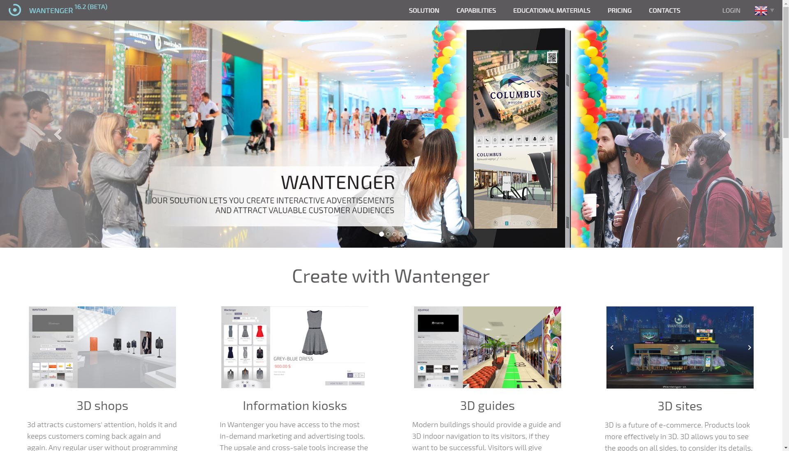

Fig. 12 Wantenger.com

First, create an archive file with your showcase. In order to do this, export all necessary files from Blender and archive them into one file. Note, that files must be directly in an archive, not in an enclosed folder.

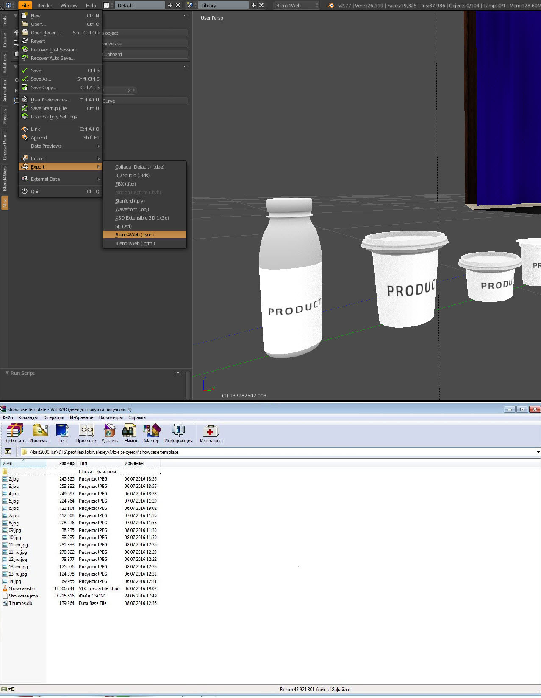

Fig. 13 Export and archive

Next, log in to your Wantenger account and go to the “Websites” tool. Create a site with the showcase template if you don`t already have one. Go to the "Showroom" section of the site, create a section and add a room to it. After that choose the created room and move to 3D model selection. Click “Upload” above the opened editor and select the archived file with your showcase.

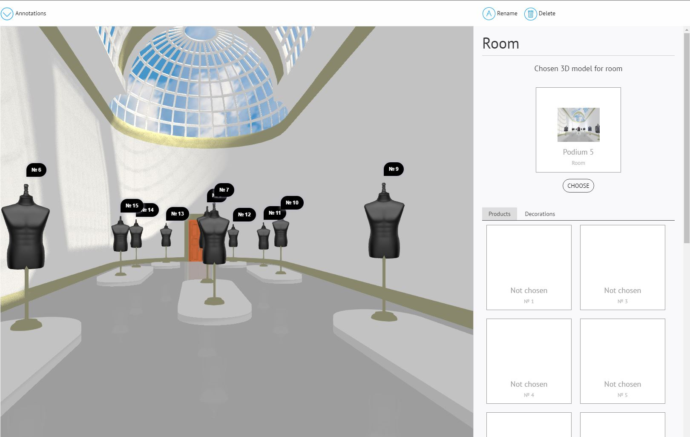

Fig. 14 Showroom editor

If all objects are properly named (with a product or productBillboard prefix for product objects), then products are automatically put in the product place list of the showroom. By clicking on a product place in the right editor you will open an editor for searching by products in the pricelist of the current profile. A search with an empty request will return a full list of products. Click on a product and if you use productBillboard, then you will be able to choose a picture of the product which will be shown. If you use 3D objects with the product prefix in a showcase, then only the price tag will be changed.

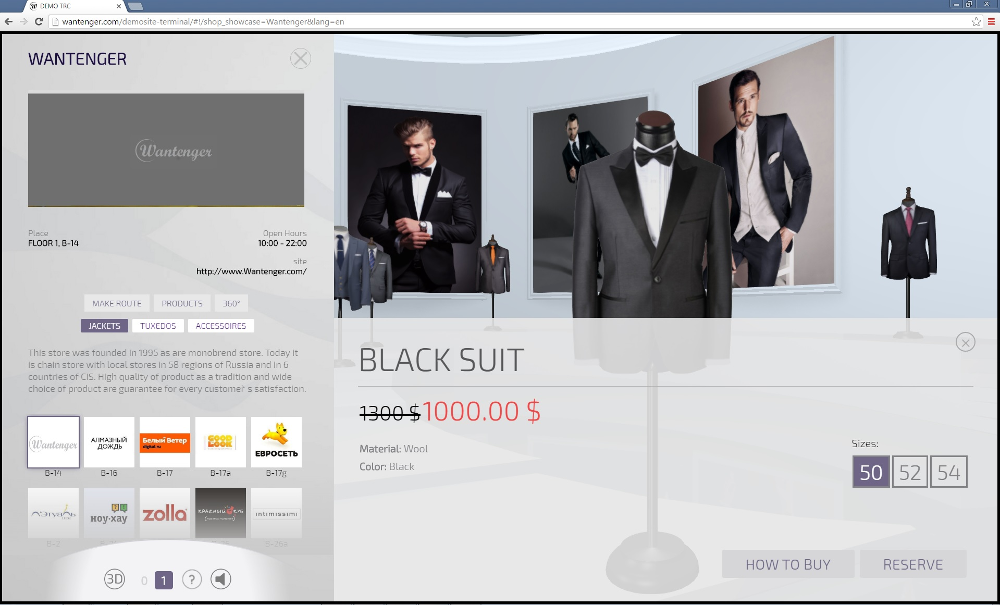

Fig. 15 Linked showcase

Now customer can not only look at the products from all sides, but also reserve the liked products

Conclusion
==========

As a result, this template allows us to create a 3D web-application showing a product in the best light and link it to the order processing system, practically creating a fully-functional 3D online store from scratch.

With the help of this template an artist can quickly put together a showcase to evaluate a new idea and create virtual product presentations to show products in the best light.

Merchandizers can evaluate ahead of time how a product will look on a shelf in one environment or another, choose the most suitable surroundings for a product or make changes to a product itself to fit its surroundings.

A 3D space of solutions is opened to customers which allows them to see a product with their own eyes without entering a store and even without getting off the couch. An interactive showcase attracts attention to a store sparking a chain reaction of a crowd and an online order system allows us to reach people who know exactly what they need and who value their time.

A video lesson is available on youtube.com https://www.youtube.com/watch?v=LRHNVlaIcqc

Download the template and a prepared example of the presentation from GitHub at https://github.com/TriumphLLC/3DSlides/archive/gh-pages.zip (distributed under the MIT open source license). A set of templates will be expanded over time, allowing you to create not only a "film" and "showcase" presentation, but also magazines, art expositions and galleries.